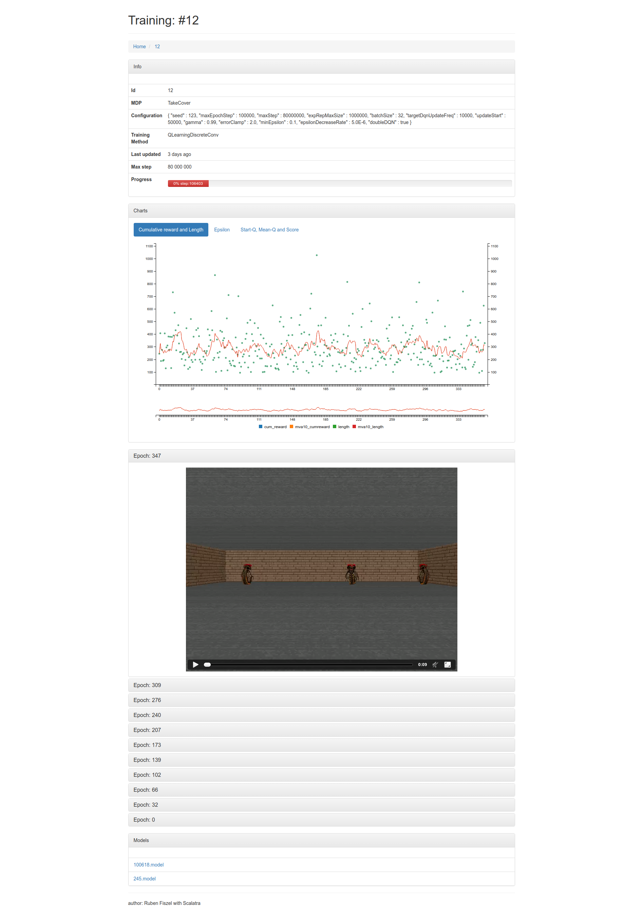

# rl4j training visualizer #

## Build & Run ##

```sh
$ cd Rl4j_Doom_Web_App
$ ./sbt
> jetty:start
> browse
```

If `browse` doesn't launch your browser, manually open [http://localhost:8080/](http://localhost:8080/) in your browser.


